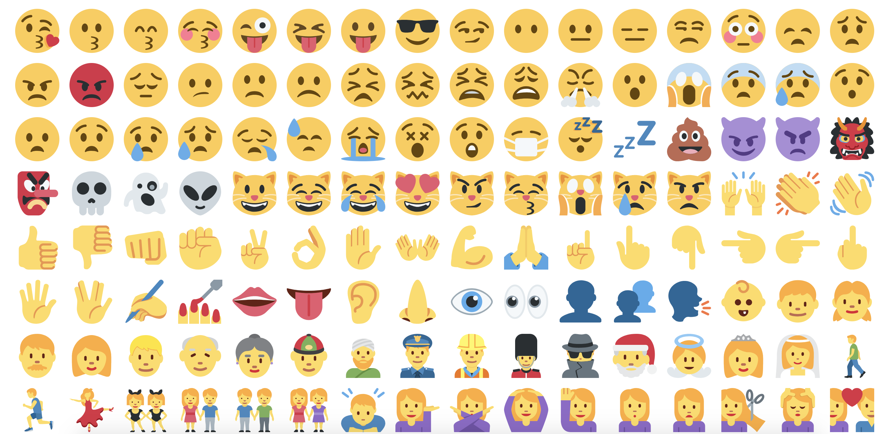

**emojiest** is a simple source for all your favorite emojis. Copy your favorite emojis with ease. Artwork by [Twemoji](https://twemoji.twitter.com/).

### Authors & Licensing

Joshua Gonzalez ([@CatsAreMLG](https://github.com/CatsAreMLG)) - [LambdaSchool](https://lambdaschool.com/) 
Samuel Ko ([@samsisle](https://github.com/samsisle)) - [LambdaSchool](https://lambdaschool.com/)

Code licensed under the MIT License: [http://opensource.org/licenses/MIT](http://opensource.org/licenses/MIT) 
Graphics licensed under CC BY 4.0: [https://creativecommons.org/licenses/by/4.0/](https://creativecommons.org/licenses/by/4.0/)